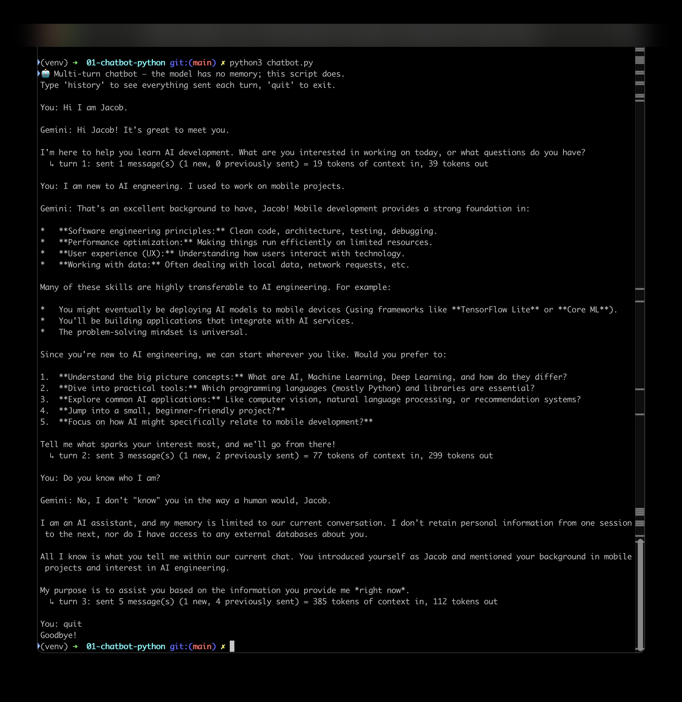

# Stage 1 — Multi-turn Chatbot (Python)

A CLI chatbot demonstrating that models are stateless — memory only exists
because you resend the full conversation history every call.

## Setup
```
python3 -m venv venv
source venv/bin/activate
pip install -r requirements.txt
```
Copy `.env.example` to `.env` and add your `GEMINI_API_KEY` (free at
https://aistudio.google.com/api-keys).

## Run
```
python3 chatbot.py
```

## What to check in the result
- Ask something, then ask a follow-up that only makes sense if it remembers the
  first answer ("what did I just ask you?"). It works because the whole `history`
  list is sent in full every turn — the context window doing its job.
- After each reply, look at the `↳ turn N: sent M message(s) (1 new, P previously
  sent) = K tokens` line. Watch P and K **climb every turn** — that growing
  "previously sent" count is the earlier conversation being re-sent in full, which
  is the multi-turn mechanic and the context window filling up. Type `history` to
  print the exact list sent next.
- If you see `ImportError: Using SOCKS proxy, but the 'socksio' package is not
  installed`, run `pip install "httpx[socks]"` (the quotes matter in zsh).
- Always run with `python3`, not `python`, on Mac — older system Python can
  shadow it.

## Screenshot

