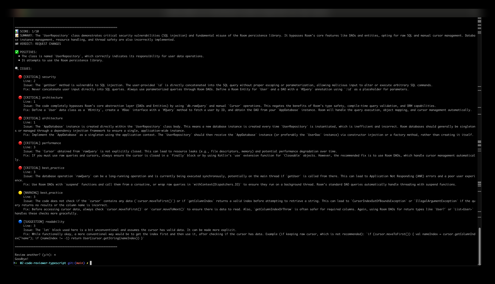

# Stage 2 — Android Code Reviewer (TypeScript)

Part of the AI Learning Journey. Paste Kotlin/Android code, get back a
structured review (score, issues, fix suggestions) — using the Gemini API.

## What this demonstrates
- Forcing a model to return valid JSON via a precise system prompt
- Typing the AI's response with TypeScript interfaces — treated as untrusted
  data until parsed, not trusted blindly
- A real prompt-engineering pattern: exact schema + "no markdown, no
  explanation" instructions

## Setup
```
npm install
```
Create a `.env` file:
```
GEMINI_API_KEY=your_gemini_api_key_here
```
Get a free key at https://aistudio.google.com/api-keys

## Run
This project is an ES module (`"type": "module"` + `nodenext` in
`tsconfig.json`), so run it with `tsx`:
```
npx tsx code-reviewer.ts
```
Paste some buggy Kotlin to try it, e.g.:
```kotlin
class UserRepository {
    val db = Room.databaseBuilder(context, AppDatabase::class.java, "users").build()
    fun getUser(id: String): User {
        val cursor = db.rawQuery("SELECT * FROM users WHERE id = '" + id + "'", null)
        return cursor.getColumnIndex("name").let { User(cursor.getString(it)) }
    }
}
```
then type `END` on its own line. (A longer version of this with a couple more
intentional bugs is in `sample-input.kt` in this folder.)

## What to check in the result
- Output should show `📊 SCORE`, `📝 SUMMARY`, `🏁 VERDICT`, and a list of
  `🔍 ISSUES` tagged critical/warning/suggestion — that structure, not the
  exact wording, is the actual point: forced JSON, not free-form text.
- The sample above should get flagged for SQL injection (string concatenation
  in the query) as at least a `critical` issue. If it gets approved with no
  critical issues, the prompt likely needs tightening.
- **If you hit a TypeScript error about `process` or `console` not being
  defined:** this project's `tsconfig.json` sets `"types": []`, which excludes
  Node's global types by default. Add `"types": ["node"]` in
  `compilerOptions` if you want full type-checking support in editors/tools.
- If you get a JSON parse error, the model occasionally wraps output in
  markdown fences despite being told not to — the code already strips
  ` ```json ` fences, but if Gemini changes its formatting habits, this is the
  first place to look.

Full write-up: see the Stage 2 page on the main site.

## Screenshot
_Tested on macOS 15.7.7._


