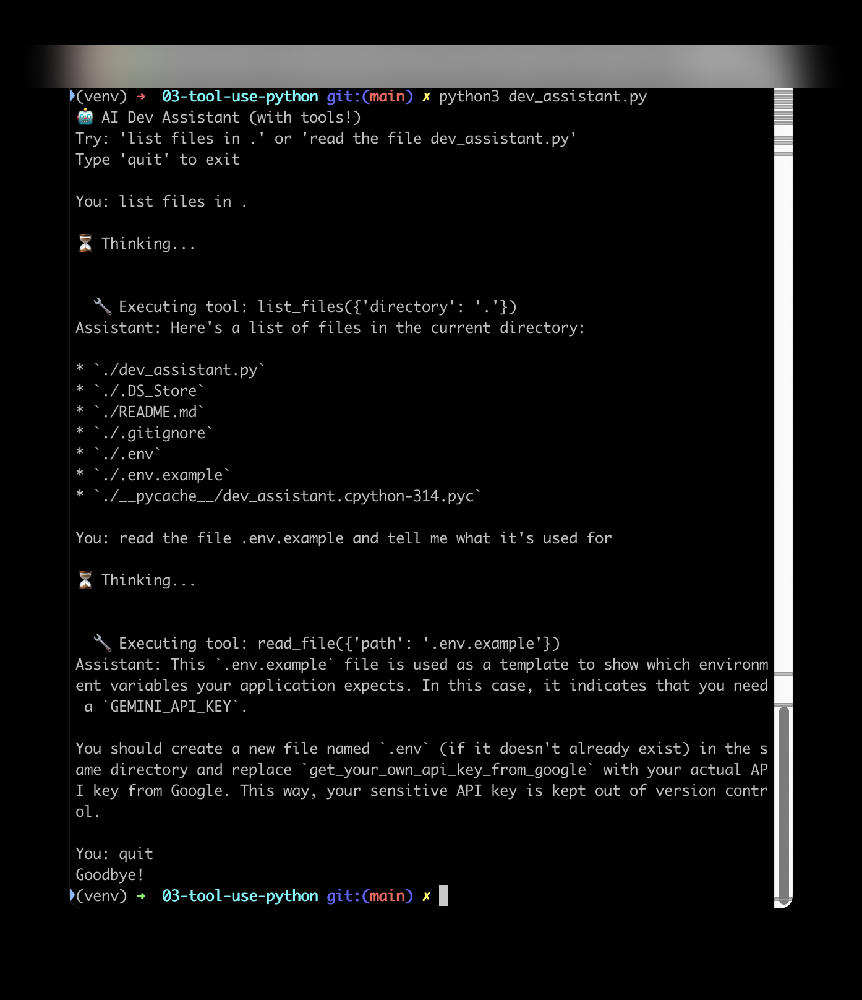
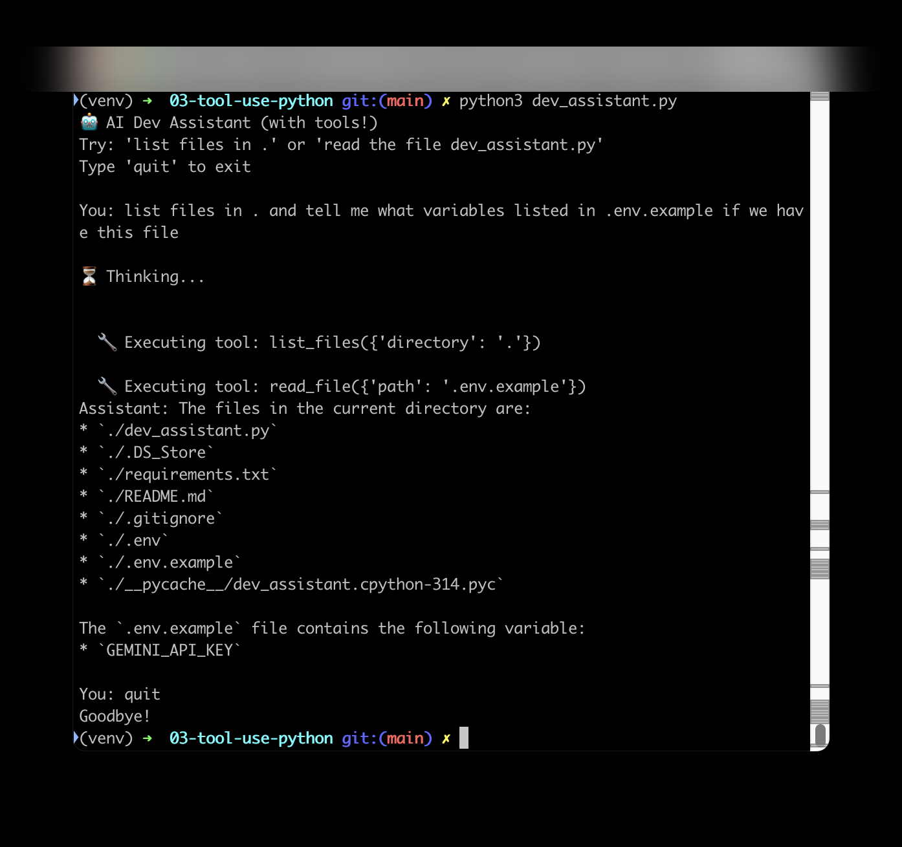

# Stage 3 — Tool Use / Function Calling (Python)

A "dev assistant" that can read files, list directories, and search code —
the model decides when to call a tool; your code actually executes it.

## Setup
```
python3 -m venv venv
source venv/bin/activate
pip install -r requirements.txt
```
Copy `.env.example` to `.env` and add your `GEMINI_API_KEY` (get one free at https://aistudio.google.com/api-keys).

## Run
```
python3 dev_assistant.py
```
Try: `list files in .`, `read the file dev_assistant.py`,
`search for the word "def" in .`

## What to check in the result
- Look for a printed line like `🔧 Executing tool: read_file({'path': '...'})`
  **before** the model's answer. That line is the actual proof a tool call
  happened — without it, the model is just describing what it would do, not
  doing it.
- Hitting a rate limit quickly while testing is normal on the free tier —
  wait ~60 seconds, or see the Stage 6 demo for the full rate-limit story.

## Screenshots


