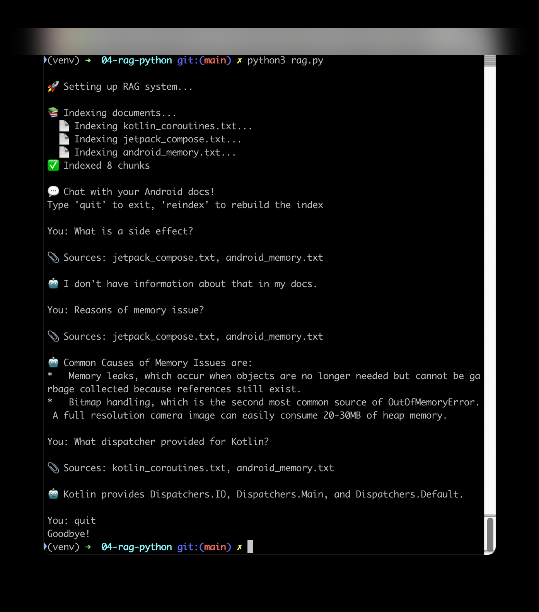

# Stage 4 — RAG: Chat With Your Docs (Python)

Chunks local `.txt` files, embeds them locally via Ollama, stores vectors in
ChromaDB, and only injects the most relevant chunks into the prompt — instead
of dumping every document into context every time.

## Setup
Install Ollama first if you don't have it — `brew install ollama` on Mac, or
download from https://ollama.com/download
```
ollama pull nomic-embed-text
ollama serve   # leave running in its own terminal

python3 -m venv venv
source venv/bin/activate
pip install -r requirements.txt
```
Copy `.env.example` to `.env` and add your `GEMINI_API_KEY` (get one free at https://aistudio.google.com/api-keys). Put a few `.txt`
files in `docs/`.

## Run
```
python3 rag.py
```
Type `reindex` the first time, or whenever you change the files in `docs/`.

## What to check in the result
- Ask a question, then look at the printed `📎 Sources:` line. It should list
  **only** the files actually relevant to that question — not every file,
  every time. If it always lists everything, retrieval isn't really filtering
  (this happens if your docs are too short to produce more than one chunk
  each — see the Stage 4 write-up for why).
- The `ImportError... socksio` fix is the same as Stage 1:
  `pip install "httpx[socks]"`.
- `zsh: command not found: ollama` means Ollama itself isn't installed yet —
  see the Setup step above, not the Python dependencies.

## Screenshot
_Tested on Python 3.14.6 · macOS 15.7.7._


