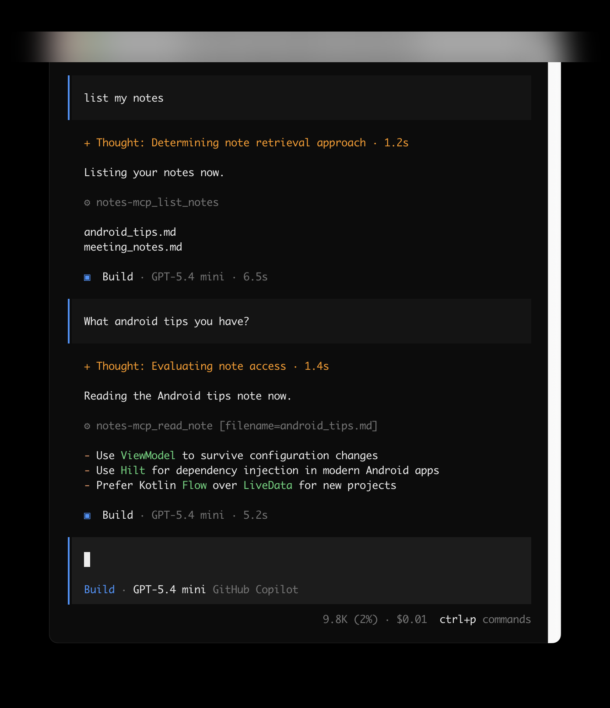
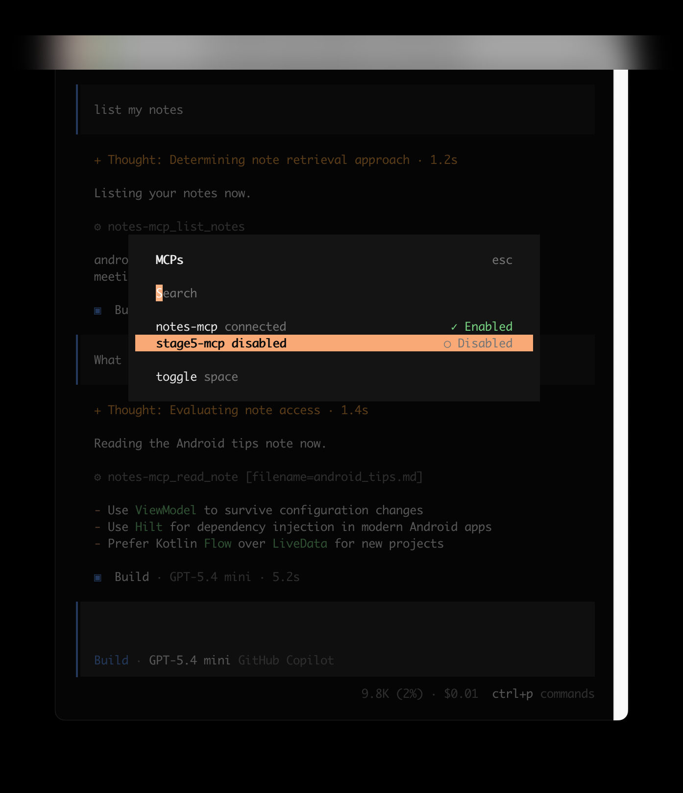

# Stage 5 — MCP Server: Notes (Python)

A small MCP server exposing `list_notes`, `read_note`, and `search_notes` as
tools — runnable over stdio (local process) or HTTP (network-reachable,
e.g. in Docker). Same logic, two transports, via `notes_core.py` +
`run_stdio.py` / `run_http.py`.

## What this demonstrates
- The same tool definitions, served two different ways — proof that the
  MCP server's logic and its transport are genuinely separate concerns
- A real, lived debugging story (see "What to check" below) about a single
  Docker networking mistake that looked like three different bugs

## Setup
```
python3 -m venv venv
source venv/bin/activate
pip install -r requirements.txt
```
Put a few `.md` files in `notes/`.

## Run — Option A: stdio (simplest, no networking)
With stdio you don't run the server yourself — the **client launches it for you**,
once per session. Just register it:
```
claude mcp add notes-local -- /path/to/venv/bin/python3 /path/to/run_stdio.py
```
(Running `python3 run_stdio.py` on its own just waits on stdin — it's a quick
"does it start?" check, not how it serves. Ctrl-C to exit.)

## Run — Option B: HTTP directly (no Docker)
```
python3 run_http.py
```
**Keep this terminal open** — the HTTP server only answers while this script is
running. Open a *second* terminal to connect a client:
```
claude mcp add notes-remote --transport http http://127.0.0.1:8000/mcp
```

## Run — Option C: HTTP via Docker (no `python3` command needed)
Install Docker Desktop first if you don't have it:
https://www.docker.com/products/docker-desktop/
```
docker build -t notes-mcp-server .
docker run -d --name notes-mcp -p 8000:8000 notes-mcp-server
```
Connect a client the same way as Option B:
```
claude mcp add notes-remote --transport http http://127.0.0.1:8000/mcp
```
Stop or restart it later without rebuilding:
```
docker stop notes-mcp
docker start notes-mcp
```

## Connecting with opencode (instead of Claude Code)
This folder ships an `opencode.json` so you can connect the server from
[opencode](https://opencode.ai). Launch `opencode` from **inside this folder** —
the paths in the config are relative to it — then pick the entry you want:

- **`notes-stdio`** (enabled by default) — opencode launches
  `venv/bin/python3 run_stdio.py` for you. No separate terminal, no networking.
- **`notes-http`** — connects to the HTTP server through an `npx mcp-remote`
  bridge. Start the server first (Option B or C) and **keep it running**, then set
  this entry's `"enabled"` to `true`.

If you start opencode from a different directory, replace the relative paths in
`command` with absolute paths to your venv's `python3` and `run_stdio.py`.

## Cleanup — unregistering everything you added
```
# Remove the MCP server registrations from Claude Code
claude mcp remove notes-local
claude mcp remove notes-remote

# Stop and remove the Docker container (if you used Option C)
docker stop notes-mcp
docker rm notes-mcp

# Optional — also delete the built image
docker rmi notes-mcp-server
```
If you added a server by hand-editing Claude Desktop's
`claude_desktop_config.json` instead of via `claude mcp add`, remove that
server's block from the `mcpServers` object yourself, then fully quit and
relaunch Claude Desktop.

## What to check in the result

- `claude mcp list` should show the server connected, not "Failed to
  connect." For more detail than `list` gives, use `claude mcp get <name>`.
- In a session, ask "What notes do I have?" — a real connection shows a
  tool-call indicator and the answer names your actual files.

**Already fixed in this code, kept here for reference:**
`run_http.py` binds to `host="0.0.0.0"`, not `127.0.0.1` — inside Docker,
`127.0.0.1` only listens within the container itself, so nothing outside can
reach it even though `docker port` looks correct. That single line was the
root cause of a debugging session that initially looked like a proxy issue,
then an IPv6-vs-IPv4 issue. If you reuse this server pattern elsewhere, keep
that binding as-is.

## Screenshots
_Tested on Python 3.14.6 · macOS 15.7.7._



