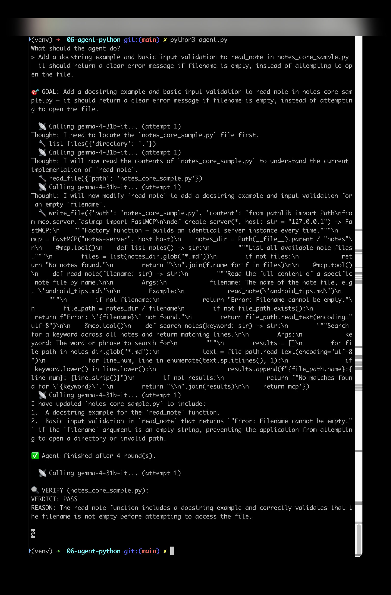

# Stage 6 — ReAct Coding Agent (Python)

Given one instruction, this agent reads real files, edits them, decides on
its own when it's done, and a **separate** model call verifies the result —
the generator/verifier split, at the harness level.

## Setup
```
python3 -m venv venv
source venv/bin/activate
pip install -r requirements.txt
```
Copy `.env.example` to `.env` and add your `GEMINI_API_KEY` (get one free at https://aistudio.google.com/api-keys). Check your own
AI Studio quota panel for the exact Flash-Lite/Gemma model string available
to your project — rate-limit numbers change often, don't trust any article's
numbers including this one.

## Run
```
python3 agent.py
```

This folder includes `notes_core_sample.py` — the actual file from the
Stage 5 MCP demo, included so the agent has a real file to edit instead of
a toy snippet. Notice `agent.py` has no reference to this filename anywhere
in its code — it's a fully generic file editor. The only place the
connection exists is in the goal text you type below, at runtime. (An
earlier version of this demo also shipped a `notes/` folder of `.md` files —
those were dropped since `agent.py`'s tools only ever touch `.py` files and
never actually run `notes_core_sample.py` as a server, so they added nothing.)

At the `What should the agent do?` prompt, try the exact goal this demo was
built around:
```
Add a docstring example and basic input validation to read_note in notes_core_sample.py — it should return a clear error message if filename is empty, instead of attempting to open the file.
```
The agent edits the file **in place**, and this folder ships
`notes_core_sample_original.py` — the pristine, pre-edit version. `diff` the two to
see exactly what the agent changed against the original, or copy the original back
over `notes_core_sample.py` to run the demo again from scratch:
```
cp notes_core_sample_original.py notes_core_sample.py
```
Without restoring it, the agent will correctly notice the goal is already satisfied
and stop immediately, which isn't as interesting to watch.

## What to check in the result
- `Thought:` lines before each tool call — that's ReAct's reasoning step
  actually firing, not just tool calls happening silently.
- `✅ Agent finished after N round(s)` — it decided on its own it was done;
  no human approved each step.
- The final `🔍 VERIFY` section is a **separate** model call grading the
  actual file — a real PASS/FAIL here is the proof the harness isn't just
  trusting the agent's own self-report.
- If you see the same tool called repeatedly with identical arguments and no
  new `Thought:` text, that's a stuck loop — usually a missing file the
  agent can't find, not a "the model is broken" problem.
- A 429 error: check whether it's RPM (waits ~15-60s, auto-retries) or
  RPD/TPM (wait for daily reset, or switch to a model with more headroom).

## Screenshot

